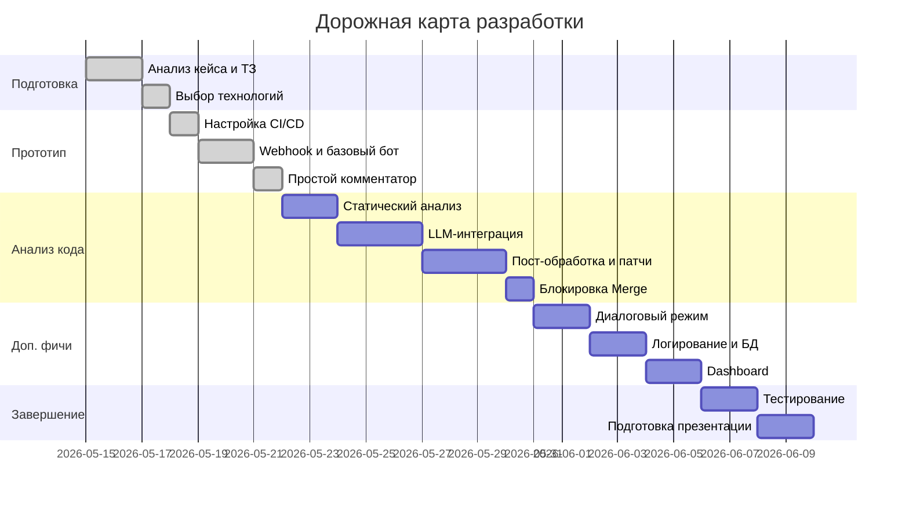

# Резюме  
Предлагается создать ИИ‑бота для автоматизации безопасности разработки: он будет анализировать Pull/Merge Request до слияния, выявлять уязвимости, секре­ты, неактуальные зависимости и даже предлагать исправления. Цель – сократить время ручного ревью, повысить качество кода и предотвратить попадание проблемного кода в продакшен. Для этого используются современные инструменты анализа кода (CodeQL, Semgrep и др.), а главное – LLM (например, GPT‑4 или его аналоги) для интеллектуального обзора. Архитектура включает микросервис с вебхуками от Git (GitHub/GitLab), модуль сбора и анализа изменений, LLM-интерфейс, хранение логов и API для комментирования в системе контроля версий. Мы предлагаем несколько «киллер‑фич»: диалоговый режим бота (обратная связь через комментарии), автоматические сниппеты-исправления, блокировка опасных слияний и пр. Приоритетно – интерактивность, автозамены и интеграция в CI/CD. Разработка разбита на этапы с четкой декомпозицией задач и сроками. В отчете проведено сравнение технологий (LLM-платформы, SAST/SCA-инструменты, сканеры секретов), предложены UX-сценарии и дорожная карта с диаграммами (mermaid).  

## 1. Анализ кейса: цели, требования и ограничения  
**Цели:** Автоматизировать проверку кода на безопасность; уменьшить время ручного ревью; предотвратить попадание уязвимостей и секретов (паролей, токенов) в основной репозиторий. Бот должен *выявлять базовые уязвимости* (SQL-инъекции, XSS), *поиски жестко закодированных секретов*, *проверять зависимости* на известные уязвимости и предлагать безопасные альтернативы. При обнаружении «очевидных» проблем бот даже может отклонять PR автоматически.  

**Требования:** 
- Интеграция с системами контроля версий (GitHub, GitLab, Bitbucket) через токены/вебхуки. 
- Сбор данных: получение диффа PR и релевантного контекста (можно исключать README, сборки, картинки).
- Анализ: объединение диффа в запрос к LLM при необходимости с использованием static-анализаторов. 
- Результат: подробный комментарий в PR (или MR) с указанием найденных проблем, ссылками, номерами строк и рекомендациями по исправлению. 
- Диалог: возможность уточнения/комментариев от разработчика, на которые бот отвечает (см. **киллер‑фичи**).
- База данных и логирование: хранение истории проверки и запросов к LLM для аудита (полное логирование ходов бота).
- Безопасность: защита передаваемых данных, контроль доступа (токены к репозиторию, ключи LLM, SSL и пр.).
- Масштабируемость: поддержка массовых PR, асинхронная обработка, горизонтальное масштабирование в случае высокой нагрузки.  

**Ограничения и доп. предположения:**  
В условии не оговорены детали (on-premise или облако, бюджет, язык проекта и т.д.), считаем открытым большинство пунктов. Предполагаем гибкость: использовать облачные сервисы (например, контейнеры AWS/Azure или Kubernetes) как опцию для быстрой реализации, но также рассмотреть on-premise (например, внутренние LLM) для приватности, если необходимо. Мы предполагаем мульти-языковость (Python, JS/CSS, Java и пр.), хотя на первом этапе можно ограничиться основными. Метрики успеха могут включать: сокращение времени ревью на X%, обнаружение Y% реально уязвимостей (с учётом FPs/FNs), удовлетворенность разработчиков, количество остановленных некритичных проблем.  

## 2. Релевантные технологии и готовые решения  
Ниже рассмотрены ключевые технологии и инструменты, которые могут быть использованы в проекте. Сравнение представлено в виде таблиц и описаний (официальные источники и документация).

### 2.1 LLM-платформы и чат-боты  
- **OpenAI GPT-4 (API)** – мощная LLM, хорошо справляется с анализом кода. Пример использования: GitHub Action «OpenAI GPT Code Reviewer» извлекает diff и отправляет в GPT-4, а затем постит комментарии с рекомендациями【9†L197-L204】【9†L258-L262】. *Плюсы:* высокая точность, поддержка кодовых контекстов, простая интеграция через API. *Минусы:* стоимость, передача кода во внешнюю среду, GDPR/COPA-безопасность. OpenAI по умолчанию не дообучает модели на пользовательских данных【25†L61-L69】.  
- **Anthropic Claude** – альтернатива GPT от Anthropic с фокусом на безопасность. Может работать через API, поддерживает роль «trusted extensions». *Плюсы:* заявленная повышенная безопасность и этичность, можно «закрыть контекст» от посторонних. *Минусы:* меньше проверок на специфичных задачах, может уступать GPT по качеству генерации.  
- **Google Vertex AI / PaLM-2** – LLM от Google. Официальный API, интеграция с GCP. Хорошо с текстом, кодом. *Плюсы:* поддерживается и сертифицирован GCP, возможно лучшее соответствие западным GDPR. *Минусы:* требует GCP, не так широко используем как OpenAI, цена.  
- **Местные LLM (LLAMA 2, Mistral, Falcon и пр.)** – можно запускать на своих серверах/GPU. Например, проект Gito поддерживает локальные модели (self-host) и OpenAI-аналогичные API【22†L348-L356】. *Плюсы:* полный контроль, нулевая передача кода наружу. *Минусы:* требуется своя инфраструктура/GPU, потенциально менее качественные результаты и высокая задержка без серьёзного HW.  
- **Другие (Meta LLaMA-3, xAI Grok, Microsoft Azure OpenAI и др.)** – все они поддерживают генерацию/анализ кода на разных условиях. Важно выбирать модель, оптимизированную под code-review. Например, микросервис легко перенастроить на любой OpenAI-совместимый API (Gito: «Works with any language model provider»【22†L348-L356】).

Таблица 1. **Сравнение LLM-платформ:**  

| **Платформа / Модель** | **Описание**                              | **Плюсы**                                  | **Минусы**                                      |
|------------------------|-------------------------------------------|--------------------------------------------|-------------------------------------------------|
| OpenAI GPT-4 / GPT-4o  | Лидер рынка генерации кода (API).         | Лучшее качество ответов, обширная память, простая интеграция【9†L197-L204】. | Высокая стоимость (запросы), передача кода (приватность)【25†L61-L69】. |
| Anthropic Claude       | LLM с упором на безопасность.             | Акцент на безопасной генерации, сертификаты для банка/допЗащиты. | Может уступать по качеству в задачах Security Code Review. |
| Google PaLM-2 / Vertex | Мощная LLM от Google Cloud.               | Интеграция с GCP, конкурент GPT, возможности SLM. | Требует GCP, меньше опытов сообщества.           |
| Металокальные (LLaMA, Mistral) | Самостоятельный развёртываемый LLM.         | Полный контроль над данными, бесплатные проекты с открытым кодом. | Требуют GPU, сложнее в настройке, производительность может быть ниже. |
| Azure OpenAI           | GPT на платформе Azure.                   | Корпоративные функции, региональные дата-центры, безопасность Azure. | Аналогично OpenAI, стоит дороже, Azure-замыкание. |

*Источник:* Обзор существующих решений (см. открытые репозитории и маркетплейсы)【7†L418-L427】【22†L348-L356】.

### 2.2 Статический анализ кода (SAST) и поиск уязвимостей  
Эти инструменты дополняют LLM или могут работать вместе с ним для повышения точности.

- **GitHub CodeQL / GitHub Advanced Security** – кодовый анализатор от GitHub. Позволяет автоматизировано находить уязвимости с помощью запросов и паттернов (SQLi, XSS, и т.д.). *Плюсы:* интеграция с GitHub Actions, поддержка многих языков (Go, JS/TS, Python, Java и др.)【26†L569-L577】. Официально именно CodeQL «разработан для автоматизации проверок безопасности»【26†L569-L577】. *Минусы:* работает в основном в GitHub Enterprise/Cloud, требует настройки query-пакетов, не всегда хорошо с бизнес-логикой.  
- **Semgrep** – инструмент SAST с возможностью AI-расширений. На сайте заявлено: «Semgrep Code (SAST) находит и исправляет реальные уязвимости... Соединив статический анализ и ИИ, он обнаруживает OWASP-риски и логические ошибки, которые пропускают традиционные сканеры»【18†L334-L341】. Имеет готовые правила и быстро настраивается. Также включает **semgrep secrets** – обнаружение секретов (паролей, ключей) и предотвращение merge при этом 【18†L334-L341】. *Плюсы:* мультиплатформенный, гибкие правила, open-source. *Минусы:* без корпоративной лицензии можно бегать правила только локально, конфигурация и интеграция потребуют усилий.  
- **SonarQube / SonarCloud** – платформа для проверки качества кода с модулями безопасности. Хороша на «домашней» проверке багов и уязвимостей. *Плюсы:* богатые метрики качества, GUI, поддерживает многие языки. *Минусы:* тяжеловесность, настройка, лицензия (для Security лучше Enterprise).  
- **OWASP Dependency-Check** – анализ уязвимостей в зависимостях (JAR, Node, Python). *Плюсы:* бесплатно, крупная база CVE. *Минусы:* не обновлялся долго, точность не так высока, нужно интегрировать.  
- **SAST библиотеки** – например, [Brakeman](https://brakemanscanner.org/) (Ruby), [Bandit](https://bandit.readthedocs.io/) (Python), [SpotBugs](https://spotbugs.github.io/) (Java) – для конкретных языков. *Плюсы:* легковесные, линтер-ориентированные. *Минусы:* узкопрофильные.

Таблица 2. **Инструменты статического анализа (SAST):**  

| **Инструмент** | **Поддерживаемые языки/сферы**        | **Плюсы**                                | **Минусы**                            |
|----------------|----------------------------------------|------------------------------------------|---------------------------------------|
| **CodeQL (GitHub)**    | Mножество (C#, Go, JS, Python, Ruby и др.)【26†L569-L577】 | Глубокий анализ, готовые сигнатуры, интеграция с GitHub Actions | Требует GitHub Enterprise/GitHub Actions, конфигурирование запросов. |
| **Semgrep**     | Многоязычный (Python, JS, Go, Java и др.)【18†L334-L341】 | Комбинирует SAST + AI, быстрое написание правил, detection OWASP【18†L334-L341】 | Платные фичи в Cloud, настройка CI/CD потребует усилий. |
| **SonarQube/Cloud** | Множество (Java, C#, JS, Python, PHP, Go и др.) | Базовая защита кода, отличные метрики и дашборд | Зависит от лицензий, требует ресурсов, много ложных срабатываний. |
| **Brakeman/Bandit/SpotBugs** | Ruby/Python/Java и др. (языковые линтеры) | Легковесно, узкоспециализированные, легко встроить (pre-commit) | Узкая область, не покрывают бизнес-логику. |

*Источник:* Документация GitHub (CodeQL)【26†L569-L577】, сайт Semgrep【18†L334-L341】.

### 2.3 Поиск «секретов» и жестко закодированных данных  
Для детектирования паролей, токенов, ключей в коде используются специализированные сканеры:

- **TruffleHog** – мощный инструмент для поиска утечек (секретов, ключей) в git-истории и файлах. Официально: «TruffleHog – самый мощный инструмент для обнаружения, классификации, проверки и анализа секретов... включает API-ключи, пароли к БД, приватные ключи и пр.»【13†L1-L4】. *Плюсы:* богатая база типов секретов, можно глубоко искать по истории, поддержка Enterprise-версии. *Минусы:* может много «шумных» находок (ложных срабатываний), требует настройки исключений.  
- **Gitleaks** – легковесный сканер секретов для git-репозиториев. Описание: «Gitleaks – инструмент для обнаружения секретов (пароли, API-ключи, токены) в git-репозиториях, файлах...»【16†L1-L4】. *Плюсы:* прост, поддерживает как CLI, так и GitHub Action【15†L349-L354】, легко интегрируется в CI. *Минусы:* фокусируется только на секретах (нет анализа уязвимостей кода), конфигурация шаблонов необходима.  
- **GitGuardian (коммерческий)**, **AWS Secrets Manager** (сканирует инфраструктуру) – можно упомянуть, но акцент на open-source.  

Таблица 3. **Секрет-сканеры:**  

| **Инструмент** | **Функциональность**                          | **Плюсы**                      | **Минусы**                        |
|----------------|-----------------------------------------------|--------------------------------|-----------------------------------|
| **TruffleHog** | Поиск секретов в git-репозитории и истории.   | Очень широкий поиск (API-ключи, пароли и др.), верификация живых секретов【13†L1-L4】. | Шумные результаты (ложные срабатывания), высокая вычислительная сложность. |
| **Gitleaks**   | Сканирует файлы/коммиты репозитория на секреты. | Простота использования, готовые правила, GitHub Action-версия【15†L349-L354】. | Требуется обновлять шаблоны, иногда пропускает нестандартные секреты. |
| **Trufflehog / Gitleaks (GitHub Actions)** | CI-интеграция (диплоемент в Actions) | Автоматический запуск при PR, комментирует сами (Actions) | Только секреты, не проверяет код на уязвимости. |

*Источник:* GitHub-страницы TruffleHog【13†L1-L4】 и Gitleaks【16†L1-L4】.

### 2.4 SCA – анализ зависимостей и библиотек  
В рамках кейса важно проверять импортируемые библиотеки:
- **Dependabot (GitHub Advanced Security)** – автоматически проверяет уязвимости в зависимостях, создает PR с обновлениями. *Плюсы:* интеграция в GitHub, широкая база известных CVE. *Минусы:* ограничен GitHub, только публичные CVE.  
- **Snyk, WhiteSource, OpenSCA** – коммерческие (и часть open-source) решения. OpenSCA описан как «инструмент для сканирования зависимостей и уязвимостей»【20†L279-L287】. *Плюсы:* глубокий анализ, база CVE, могут предлагать версии-фиксы. *Минусы:* часто платные, сложность настройки.  
- **OWASP Dependency-Check** – бесплатный сканер (в JAVA/Jenkins основном).  

В нашем микросервисе можно вызвать SCA-инструмент для проверок (например, запустить OpenSCA CLI или Snyk API) и передать результат боту.  

*Источник:* Список SCA-инструментов【20†L279-L287】.

### 2.5 Интеграция с Git и CI/CD  
- **GitHub/GitLab API, вебхуки** – официальный способ привязать бота. Бот регистрируется как «GitHub App» или использует токен сервисного аккаунта. По вебхуку «новый PR» или коммент поступает запрос к нашему сервису. Далее через REST API отправляем комментарии (GitHub: «Create a review comment»【23†L0-L8】).  
- **GitHub Actions / GitLab CI** – мы можем как альтернатву использовать Action для запуска анализа (пример: micahstubbs/gpt-code-review)【7†L418-L427】. Это упрощает развёртывание (DevOps ловит webhook, запускается Action, пишет коммент). Однако собственный сервис гибче (с поддержкой диалогов, истории).  
- **CI/CD** – регулярное тестирование самого бота: можно настроить пайплайн с Jenkins/Travis для проверки новых функций (lint, юниты, интеграционные тесты с эмуляцией PR). Развёртывание можно влечь через Docker-образы, K8s, серверы приложений (AWS ECS/EKS, GKE или Azure AKS).  

### 2.6 Архитектурные компоненты  
- **База данных** – нужен хранилище (например, PostgreSQL, MongoDB, DynamoDB) для хранения логов запросов, конфигураций репозиториев, истории взаимодействий бота. Это позволит анализировать эффективность и обеспечивать продолжение диалога.  
- **Логирование и мониторинг** – ELK-stack или облачные сервисы (CloudWatch, Azure Monitor) для аудита работы бота, сбора метрик (задержка LLM-запросов, частота срабатываний).  
- **Инфраструктура** – Docker/Kubernetes для развертывания, авто-масштабирование. В облаке (AWS/GCP/Azure) минимальный вариант – микросервис на AWS ECS с Lambda-триггерами на вебхуки или App Engine. Для on-prem – виртуальная машина/сервера в DMZ.  
- **CI/CD интеграция** – GitHub Actions или аналог в GitLab для автоматического тестирования изменений в боте.  

### 2.7 Сравнение технологий (таблица)  
В Таблице 4 приводится сравнение ключевых технологий по функциональным критериям:  

| **Компонент**        | **Инструмент**         | **Роль в системе**              | **Плюсы**                                   | **Минусы**                                        |
|----------------------|------------------------|---------------------------------|---------------------------------------------|---------------------------------------------------|
| **LLM-модель**       | OpenAI GPT-4/4o        | Анализ кода, генерация ответов  | Высокое качество, богатый контекст【9†L197-L204】 | Стоимость и передача кода в облако.               |
|                      | Anthropic Claude       | Аналог GPT (безопасный AI)      | Повышенные гарантии безопасности           | Пока менее распространен, цена/доступность.       |
|                      | Локальная LLaMA 2      | Приватный анализ на месте       | 100% контроль над данными, без внешних запросов【22†L348-L356】 | Нужен сильный HW/GPU, настройка сложнее.          |
| **SAST-сканер**      | GitHub CodeQL          | Поиск уязвимостей в коде        | Мощный движок, интегрирован в GitHub Actions【26†L569-L577】 | Требует GitHub Enterprise, настройка запросов.    |
|                      | Semgrep                | SAST+AI для кода и секрета      | Комбинированный анализ, мало ложных срабатываний【18†L334-L341】 | Некоторые фичи платные, понадобится интеграция CI. |
| **Сканер секретов**  | TruffleHog             | Поиск API-ключей, паролей       | Очень обширная база секретов【13†L1-L4】      | Может выдавать много ложных тревог, ресурсозатратно. |
|                      | Gitleaks               | Поиск простых секретов          | Легкий, готов к GitHub Actions【16†L1-L4】    | Настраиваемые шаблоны нужны, не выявляет сложные сценарии. |
| **SCA (библиотеки)** | OpenSCA, Snyk, Dependabot | Проверка уязвимостей в зависимостях | Широкая база CVE, обновления, рекомендации по версии | Платные (Snyk), частная база (OpenSCA, Limit).    |
| **CI/CD**            | GitHub Actions, Jenkins | Автотестирование, деплой бота   | Стандартная практика, готовые плагины/Actions | Зависимость от выбранной платформы, настройка.     |
| **Хранение**         | PostgreSQL / MongoDB   | База данных результатов анализа | Надежность, ACID / Гибкость для логов       | Требует администрирования, резервное копирование.  |
| **Инфраструктура**   | AWS/GCP/Azure, K8s     | Развёртывание сервиса           | Масштабируемость, контейнеризация          | Стоимость, сложности DevOps для быстрого старта.  |

*Источник:* материалы о LLM и SAST (GitHub docs【26†L569-L577】, Semgrep【18†L334-L341】, Git-сканеры【13†L1-L4】【16†L1-L4】).

## 3. Предлагаемая архитектура системы  
Основная идея – микросервисная архитектура, где бот состоит из следующих компонентов:

- **Webhook Listener / Integration**: получает события (создание/обновление PR, комментарии) от Git-системы через защищенный вебхук. Производит аутентификацию (конфигурирует сервисный аккаунт с правами на чтение PR и запись комментариев).  
- **Data Collector**: по событию PR получает через Git API (GitHub/GitLab API) информацию о изменениях: дифф, список изменённых файлов, содержимое контекста. Отбрасывает файлы из «ignore»-списка (билды, документацию).  
- **Analysis Engine**: самый «умный» модуль. Состоит из:
  - *Static Analyzer* (встроенные SAST-скрипты, например, Semgrep, CodeQL CLI или собственные настраиваемые правила) для быстрого обнаружения простых проблем (SQLi, XSS, неправильный парсинг и т.п.).
  - *LLM Interface* – формирует запрос (prompt) к выбранной LLM-модели, включая дифф (или части кода) и контекст. Запрашивает анализ кода на уязвимости, генерацию рекомендаций. Примеры: «Find security issues in this diff», «Suggest fix for the XSS at line 42», «Is this use of `eval` vulnerable?».  
  - *Post-processor* – объединяет результаты статического и LLM-анализа, фильтрует дубли, формирует итоговые выводы. Строит структуру ответа (уязвимость, уровень критичности, файл/строка, ссылка на описание CWE/CVEs, предлагаемый сниппет-фиксер).  
- **Commenter (Response Manager)**: через API (GitHub Pull Request Review API или Issue Comments API【23†L0-L8】) публикует результаты. Комментарий может быть в нескольких видах: inline-комментарии на строках и/или единый обзорный комментарий. Может упоминать релевантные CWE или документацию. Если критическая уязвимость – опционально отправляет «decline» команду/label.  
- **Dialog Manager**: обрабатывает ответы разработчиков (например, команды в комментариях, уточняющие вопросы). Вызывает Analysis Engine заново для «понимания» уточнений. Так бот поддерживает цепочку вопросов-ответов.  
- **Database / Log Store**: сохраняет историю PR, вопросов и ответов, результаты анализов, запросы LLM, исключения (чтобы анализировать работу, строить статистику, улучшать систему со временем).  
- **UI/Конфиг**: (опционально) веб-интерфейс для настройки бота: список репозиториев, токены, уровни критичности, опции экспорта логов. Можно предусмотреть дашборд (grafana/Cloud) с метриками (количество проверок, найденные уязвимости по категориям).  
- **CI/CD & Deployment**: вся логика упакована в Docker-контейнер(ы). Разворачивается в Kubernetes/ECS или на виртуальной машине. Используется провижнинг секретов (Vault/AWS Secrets Manager). В GitHub Actions/CI задаются шаги для покрытия unit и интеграционных тестов сервиса.  

Схема архитектуры (упрощённо):  

```mermaid
graph LR
    subgraph Developer
        Dev[Разработчик]
    end
    subgraph GitPlatform
        GitHub((GitHub/GitLab))
    end
    subgraph BotService[ИИ-библиотека анализа (микросервис)]
        DataCollector[Data Collector]
        AnalysisEngine[Analysis Engine]
        Commenter[Comment Manager]
        Database[(DB/Logs)]
        Dialog[Dialog Manager]
    end
    Dev -->|Создает/обновляет PR| GitHub
    GitHub -->|Webhook (PR открытие/обновление)| DataCollector
    DataCollector -->|Получает дифф| AnalysisEngine
    AnalysisEngine -->|Static scan + LLM вызов| AnalysisEngine
    AnalysisEngine -->|Формирование отчета| Commenter
    Commenter -->|POST-комментарий| GitHub
    Dev -->|Комментирует бот| Dialog
    Dialog -->|Новый запрос к анализу| AnalysisEngine
    BotService --> Database
    style Developer fill:#f9f,stroke:#333,stroke-width:1px
    style GitPlatform fill:#bbf,stroke:#333,stroke-width:1px
    style BotService fill:#bfb,stroke:#333,stroke-width:1px
```

**Описание архитектуры:** разработчик создаёт PR (пункт 1), Git-платформа шлёт вебхук бот-сервису (2), который через DataCollector получает дифф и файлы (3). AnalysisEngine выполняет статический анализ и/или опрашивает LLM (4) — результатом является отчёт по уязвимостям. Commenter публикует комментарий (5). Если разработчик отвечает (6), Dialog Manager перезапускает анализ уточнений. Все действия логируются в БД (7).  

### Безопасность и приватность  
- Используем HTTPS для вебхуков. 
- Токен Git имеет минимальный набор прав (PR: read, issues/comments: write). 
- Ключи LLM хранятся в секрете (Secrets Manager).  
- По умолчанию OpenAI не использует клиентские данные для тренировки【25†L61-L69】. Но если требуются строгие гарантии, можно настроить Enterprise-режим или использовать локальные LLM【22†L348-L356】.  
- Код и конфиг сервиса деплоятся в приватной сети или защищённом VPC.  

### Масштабируемость и расчёт стоимости  
Сервис легко масштабируется: каждая задача анализа PR изолирована. В случае наплыва можно параллелить запросы к LLM (например, для больших PR разбить на чанки). Стоимость разработки: основная — оплата API LLM (оплата по числу токенов) и облачной инфраструктуры. При большом количестве запросов имеет смысл использовать модели более дешёвые (см. таблицу LLM). Минимизировать токены поможет предварительный стат-анализ (отсеять безопасные части).  

## 4. «Киллер‑фичи» проекта  
Ниже приведены минимум 6 уникальных функций, которые сделают проект привлекательным и впечатляющим для жюри. Особое внимание — технической осуществимости, затратам и демонстрации. Установлены 2–3 приоритетные фичи.  

1. **Интерактивный диалоговый бот в PR:** разработчик может **ответить** на комментарий бота или упомянуть его командой (например, `@AI-Bot explain more`), и бот продолжит диалог, уточняя контекст. Технически: мы отслеживаем новые комментарии с тегом бота, парсим их и направляем в LLM заново. Польза: эффект «живого эксперта» повышает доверие жюри. **Ресурсы:** модуль обработки комментариев, триггер LLM. **Риски:** нужно отслеживать состояние диалога (контекст), сложность в управлении памятью диалога. **Демо:** на презентации показать, как после первого анализа разработчик пишет боту «почему SQL-инъекция?», бот отвечает, аргументируя.  

2. **Автоматические сниппеты для исправления:** при обнаружении уязвимости бот генерирует **конкретный фрагмент кода (patch)** с исправлением. LLM отлично подходит для задачи «исправь этот уязвимый код». Это впечатлит жюри как «код пишет код». Например, бот найдёт XSS и предложит обёртывание в функцию `escapeHTML()`. **Требуется:** конструкция корректных промптов («fix code in XYZ way») и проверка результатов (автотесты). **Риски:** LLM может предложить неточный код (нужна валидация и ограничение вмешательства). **Демонстрация:** показать PR до/после: бот комментирует и предлагает diff для исправления, после чего PR автоматически апдейтится (или Dev руками), демонстрируя закрытие уязвимости.  

3. **Блокировка merge при критических уязвимостях:** если бот находит «очень опасную» проблему (CVE высокой степени или явную бомбу), он ставит метку/пишет специальный комментарий с пометкой “🚫 BLOCK” и, с помощью API Git, меняет статус PR на «нельзя смерджить» или обновляет политику защищённых веток. Это реальный механизм «остановки опасного кода». **Почему впечатляет:** автоматический gate-keeper в DevSecOps. **Риски:** ложные блокировки разозлят разработчиков – нужно тщательно продумать уровни критичности и опциональное ручное подтверждение. **Демо:** сделаем «песочницу» с мёрджем: когда бот обнаружит SQL-инъекцию, PR будет мигом заблокирован (микроизображение замка и текст «Cannot merge due to critical vulnerability»).  

4. **Поддержка нескольких языков и технологий:** бот анализирует не только код, но и конфиг-файлы (Dockerfile, CI), инфраструктуру как код (Terraform, Helm), докер-команды. **Впечатлит:** универсальность. Например, бот заметит плохо настроенный TLS в nginx-конфиге. **Ресурсы:** расширить парсеры и шаблоны запросов, добавить правила SAST для YML/JSON. **Риски:** много новых правил, рост False Positive. **Демо:** пример, когда бот анализирует не-программный файл (например, PR с изменением Dockerfile или workflow) и указывает на уязвимость в конфигурации.  

5. **Аналитическая панель (Dashboard) и отчёты:** помимо комментариев, бот аккумулирует статистику по проекту: сколько уязвимостей найдено, с какими языками, тренды по времени. Наглядные графики по типам ошибок. **Впечатляет:** полнота решения (DevSecOps-радар в реальном времени). **Ресурсы:** легкий фронтенд (внутренний сайт или интеграция с Grafana), сбор и агрегирование метрик. **Риски:** доп. фронтенд – время; можно ограничиться «живыми» раздаточными графиками на слайде. **Демо:** при защите показать mockup дашборда с текущими метриками и «heatmap» уязвимостей.  

6. **Интеллектуальный алгоритм подбора правил:** бот способен накапливать фидбек разработчиков (например, когда они маркируют предупреждение как «false positive») и настраивать «память» (супрессоры) для уменьшения похожих ошибок. Это расширение концепции *Keep, Human* – бот «учится» и со временем делает меньше шума. **Впечатлит:** наличие адаптивного ИИ-компонента. **Ресурсы:** хранение исторических срабатываний, простой ML (decision tree) или use of LLM для классификации. **Риски:** разработать алгоритм быстро сложно, можно реализовать базовый (фильтр по хешу кода). **Демо:** показать, что первый PR забил на несущественную конструкцию, но бот в следующий раз её игнорирует (сделано вручную для демонстрации).  

Дополнительные фичи (для полной конверты): интеграция с таск-трекерами (JIRA), сканирование Docker-образов, поддержка голосовых/чат-интерфейсов (например, Slack/Bot в Teams). Приоритетными считаем **диалог**, **патчи-исправления** и **блокировку merge** как самые «продаваемые» в демо.  

## 5. План реализации проекта  
Предлагается разбить работу на этапы с назначением ролей (команда ~4–6 человек: DevOps-инженер, backend-разработчик, security-специалист, проектный менеджер, тестировщик, UI-дизайнер). Ниже представлен **табличный план** и диаграмма Ганта mermaid.

**Таблица 5. Дорожная карта (задачи, роли, оценки):**  

| **Этап / Задача**                              | **Описание**                                                    | **Оценка**  | **Роли**          |
|-----------------------------------------------|-----------------------------------------------------------------|-------------|-------------------|
| **1. Подготовка и дизайн**                     | Сбор требований (анализ кейса), выбор стека и инструментов.     | 2 дня       | Аналитик, лидер   |
| Сбор & анализ требований                        | Изучение кейса, уточнение метрик успеха, составление ТЗ.        | 1 д         | Аналитик          |
| Поиск технологий                               | Изучение SAST/SCA/LLM решений, выбор базовых компонентов.      | 1 д         | Tech-лид          |
| **2. Инфраструктура и прототип**               | Развёртывание окружения, прототип вебхука, минимальный PR-бот. | 5 дней      | DevOps, Backend   |
| Настройка CI/CD                                | Подготовка репозитория, CI-пайплайна (тесты, Docker).          | 1 д         | DevOps            |
| Создание Skeleton-библиотеки бота              | Микросервис, слушающий PRs, просто логирует события.           | 1 д         | Backend           |
| Интеграция с GitHub/GitLab                     | Реализация вебхуков, получение диффов через API.               | 2 д         | Backend           |
| Первичная публикация коммента                  | Test: бот пишет простой ответ (приветствие) в PR (через API).  | 1 д         | Backend           |
| **3. Разработка анализа**                      | Основная работа над обнаружением уязвимостей и AI-моделями.    | 8 дней      | Backend, Security |
| Подключение статических анализаторов (Semgrep) | Встроить Semgrep/CodeQL CLI, настроить базовые правила (SQLi,XSS). | 2 д     | Security, Dev     |
| Формирование prompt и LLM API                  | Разработка генерации запроса для LLM (с учётом токенов); отправка; прием результата. | 3 д | Backend, Security |
| Пост-обработка результатов                     | Парсинг ответа LLM, объединение с SAST; фильтрация ложных срабатываний. | 2 д  | Backend           |
| Генерация рекомендованных исправлений         | Механизм формулировки «поправок» в коде (diff-патч) через LLM. | 1 д         | Backend, Security |
| Авто-decline/Block Merge                       | Добавление флага «block» в PR при критических находках.         | 1 д         | Backend           |
| **4. Улучшенные возможности**                  | Доп. функционал (диалог, логирование, UI).                      | 6 дней      | Backend, Frontend |
| Поддержка диалога (Replying to comments)       | Обработка комментариев разработчика, поддержание контекста.    | 2 д         | Backend           |
| Логирование и БД                               | Сохранение истории запросов/ответов (структура БД).             | 2 д         | DevOps, Backend   |
| Простая панель мониторинга                     | Отчет с метриками (графики количество ошибок, типы).           | 2 д         | Frontend/DevOps   |
| **5. Тестирование и подготовка демонстрации**   | Юнит и интеграционные тесты, финальный демонстрационный репозиторий, подготовка слайдов и видео. | 4 дня      | QA, Dev, PM       |
| Тестирование (unit/integration)                | Написание автотестов (mock PR, edge-cases: пустой PR, бинарные файлы) | 2 д  | QA, Dev          |
| «Готовый кейс» для демонстрации                | Подготовка примеров PR с заранее встроенными уязвимостями.      | 1 д         | Dev              |
| Репетиция демонстрации                         | Прогон сценария на время, фиксы по отчётам.                    | 1 д         | Все члены команды |



**MVP (минимальный продукт):** получение и анализ PR, комментарий с описанием уязвимостей и предложениями. **Stretch Goals:** полный диалог, авто-блокировка, аналитика, мультиязыковость (нефтепродукт).  

## 6. UX/UI и сценарии использования  
- **Сценарий «PR-review»**. Разработчик открывает PR. Через несколько минут появляется комментарий от бота (своим аватаром). В нём бот пишет: «Найдены потенциальные проблемы в файле `auth.js`: 1) Возможна SQL-инъекция в `db.query`, 2) Явный токен доступа в конфиге». Далее – фрагмент кода (patch) для исправления и ссылка на CWE/ответ в документации. Разработчик видит результаты прямо в интерфейсе GitHub (поддерживаются inline-комментарии, группируемые по файлам). Это привычный UX (в духе GitHub Actions-проверок).  
- **Диалоговый сценарий:** разработчик не понял причину. Он отвечает на комментарий `/ai explain`, бот «перечитывает» проблему и отвечает разъяснением: «SQL-инъекция здесь означает, что переменная `user_id` не экранирована…». Такой поток напоминает работу с ревьюером в коде, но реализован ботом.  
- **Блокировка мёржа:** если уязвимость **критична** (например, найдена RCE или утечка секретов), бот не просто комментирует, но и с помощью API выставляет `merge blocked`. В интерфейсе GitHub рядом с кнопкой «Merge» появляется замочек и сообщение «Merge blocked: fix security issues first». Это явно покажет жюри, что бот «по-настоящему» защищает проект.  
- **UX панели:** на веб-интерфейсе (или встроенном dashboard GitHub) видно общее состояние: число PR, кол-во открытых рисков, динамику за неделю. Например, график «ошибок по типам» и список последних анализов. Ускорит понимание и произведет впечатление «full stack» решения.  

**Edge-cases:** тестируем сценарии: пустой PR (бот тихо пропускает), очень большой PR (бот анализирует по частям, отправляет interim-результаты), ошибки внешних API (если LLM не отвечает – бот пишет «ошибка анализа, попробуйте позже»).  

## 7. Диаграммы и таблицы  
В отчёте приведены следующие диаграммы и таблицы:

- **Архитектурная схема** (выше) – граф потоков между участниками системы.
- **Диаграмма Ганта** – план по этапам (выше).
- **Таблицы сравнения** технологий (см. раздел 2.7) и дорожной карты (таблица 5).
- **Фичи (отдельной таблицы нет)**: описаны в тексте §4.  

Все диаграммы созданы с помощью `mermaid` (вопрос №7 требования).

## 8. Приоритетные источники и ссылки  
- Документация GitHub CodeQL (GitHub Security Lab) – **описание CodeQL** как движка для анализа кода【26†L569-L577】.  
- GitHub Marketplace – **OpenAI GPT Code Reviewer Action** (использует GPT для комментирования PR)【9†L197-L204】【9†L258-L262】.  
- Репозиторий **GPT-5.x PR Reviewer** – пример Action на основе GPT для обзора PR【7†L418-L427】.  
- **Nayjest/Gito** – open-source AI code reviewer, поддерживающий любые LLM【22†L315-L323】【22†L348-L356】.  
- **Semgrep.dev** – описание AI-усиленного SAST и секрет-сканера Semgrep【18†L334-L341】.  
- GitHub TruffleHog и Gitleaks – *README*: «TruffleHog – мощный инструмент для обнаружения секретов»【13†L1-L4】, «Gitleaks – инструмент для обнаружения паролей и ключей»【16†L1-L4】.  
- **awesome-sca (GitHub)** – список инструментов SCA, упоминающий OpenSCA, Snyk и др.【20†L279-L287】.  
- OpenAI – **Security & Privacy**: дано, что по умолчанию пользовательские данные не используются в обучении【25†L61-L69】.  

Эти источники (а также стандартная документация GitHub API, OpenAI, LangChain и пр.) подтверждают выбранные решения и практики, описанные в отчёте. 

